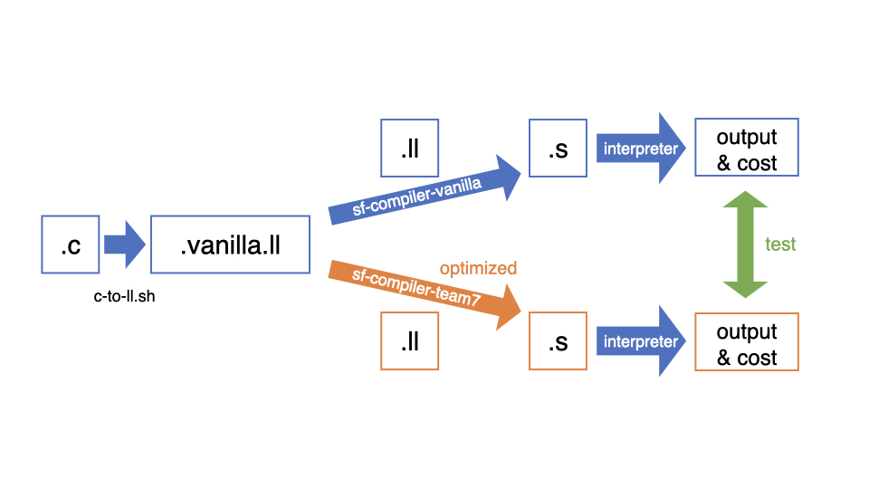

# SWPP Compiler for Team 7

## About Development

Programs on this project are divided into the three parts.

  * Compiler(`src/core`)
    * This is for making the main compiler that uses optimization passes.
    * Also, there is a backend that translates IR code to Assembly.
  * Optimization(`src/passes`)
    * It contains every optimization created by ourselves.
    * Also, there are several passes from TA's repository.
  * Test(`src/test`)
    * It contains codes for testing.
    * It will be used to make the vanilla compiler to compare with.

To execute a c code, we need to turn it into a machine friendly language. It can be done with gcc compiler easily, but it's too easy that it's hard to expect good performance.



Our compiler will read the same c code to make better assembly code using LLVM optimization. It will first transfer c code into ll with llc in LLVM. Then it will apply optimization passes, and transfer to assembly language using the backend. To execute assembly and measure the cost, we need an interpreter, which is also included in our project.

Our test code will compare the outputs and costs between the optimized compiler and vanilla one. The vanilla compiler does not optimize anything. The test program will compare two outputs and interpreter's logs from each assembly code.


## How to run project

* Build
  ```
  make #or make all
  ```
  ```make``` command will automatically build 3 executable programs inside ```bin``` directory: sf-compiler-team7, interpret, sf-compiler-test-team7, sf-compiler-vanilla.

* Test
  ```
  make test
  ```
  ```make test``` command will check if the compiler runs with no error with given test cases. It will also compare performance with the vanilla compiler.


## How to execute individual programs.

* sf-compiler-team7 (./bin/)
  ```
  ./bin/sf-compiler-team7 <input.ll> -o <output.s> -d <output.ll>
  ```
  Our compiler compiles IR code(.ll) to assembly code(.s). It links `read` and `write` functions in the LLVM library, applies passes, and then translates to assembly code. "-o" flag specifies the name of the output assembly file. If it is not given, it will be set to default value "a.s". "-d" flag is optional. It specifies the name for output IR code. If it is given, it also prints IR code which the optimization passes are applied from the original IR code.

* checker.sh (./workspace/)
  ```
  ./workspace/checker.sh <testcase path(s)>
  ```
  This is a shell script which ```make test``` command calls. It checks every given testcase directory. There are `.c`, `.ll` and `.s` files on each src folder, which are the compilation results from the vanilla compiler. It first translates IR(`.ll`) code to assembly code using our compiler: sf-compiler-team7. It will check if the outputs of two assembly codes are the same values, and compare their costs.

* sf-compiler-test-team7 (./bin/)
  ```
  ./bin/sf-compiler-test-team7
  ```
  This is googletest. It currently checks nothing.

* test-gen.sh (./workspace/)
  ```
  ./workspace/test-gen.sh <testcase dir> [<llvm bin path>]
  ```
  This program generates `.ll` and `.s` files from `.c` using the vanilla compiler. After that, it becomes a valid testcase folder. If the llvm bin path is not passed, then it contruct a testcase structure at the given testcase dir using `./workspace/template.c`.
