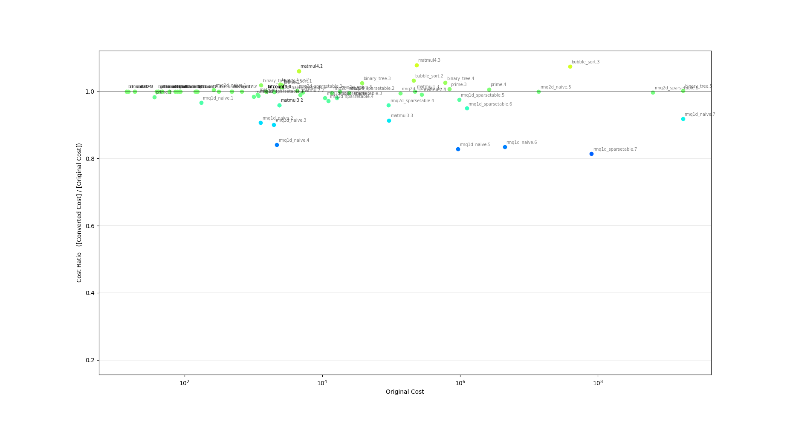
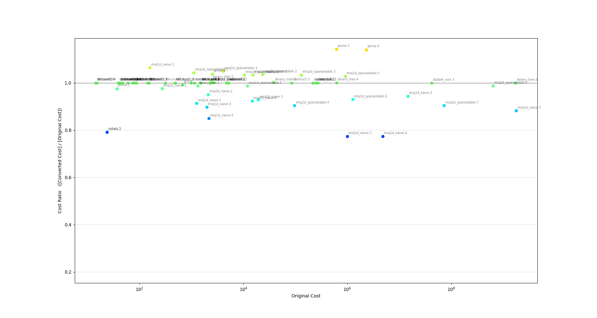
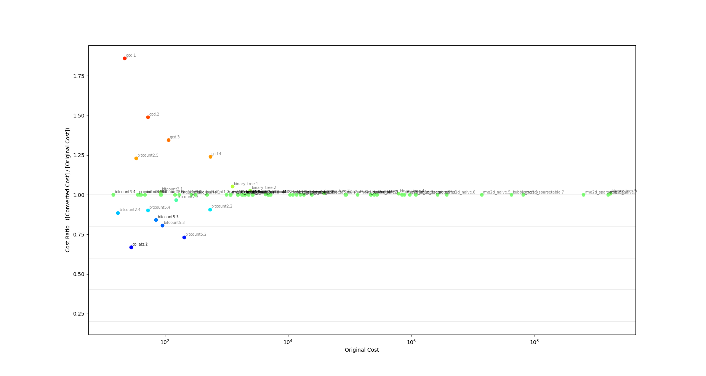
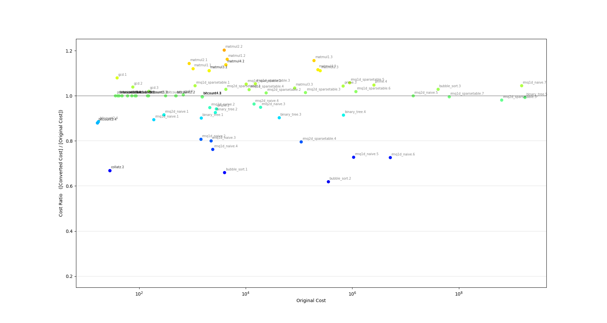
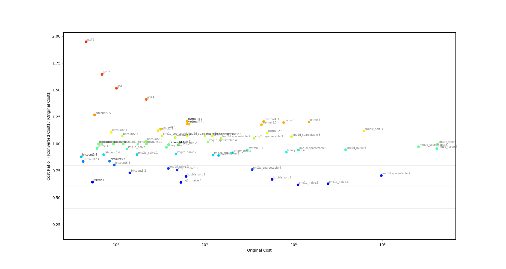
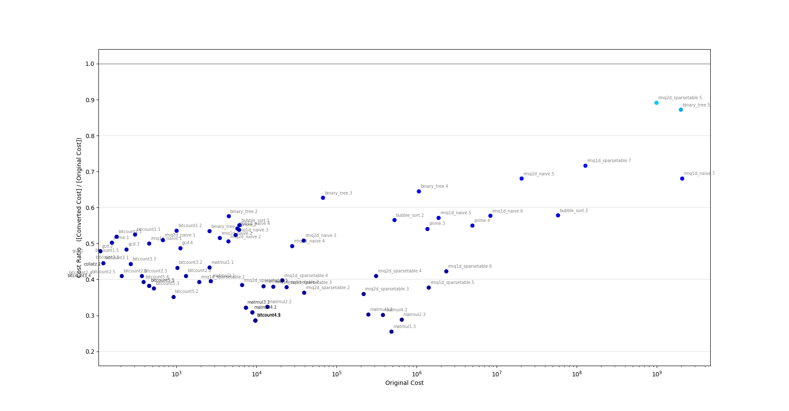

# Progress Report for Sprint 3

### Overall

During the sprint 3, we made an impressive improved in costs compared to the last sprints. First of all, we designed a block-level new register allocation mechanism that works efficiently by calculating the lifespans of each register. Also, the backend erases all unused alloca slot from the depromoted module to reduce the stack usage. Furthermore, the backend detects memory access switching points(HEAP<->STACK) and inserts reset instructions on them. Finally, we designed a pass that converts malloc to alloca to reduce the heap usage.

Besides that, we made a concurrent case test script to reduce the test time. And tried to find the best combination of existing passes and ours, which will be updated on the wrap-up time due to the dependency issue(Since it can be added after all PRs are merged).

The upgraded compiler passed all test benchmarks and the general cost improvement(of cost sums) was about [20.82% for total sum of cost, the mean optimized ratio was 54.6%] compared to the last sprint.([29.86% for total sum of cost, the mean optimized ratio was 60.1%] compared to the vanilla compiler.)


<center>Plotting Result of SP3 vs Vanilla Compiler, y-axis is [SP3 cost] / [Vanilla Cost], Low value is better</center>


### Added Feature of Compiler and Test

#### Compiler

```bash
./bin/sf-compiler-team7 input.ll -o output.s -d output.ll -except "WeirdArith,PackRegister"

./bin/sf-compiler-team7 input.ll -o output.s -d output.ll -nopass
```
With the "except" flag, we can choose which passes not to apply while compiling. To apply none of the pass, we can use "nopass" option.

#### Test

```bash
#google check + shell unit test + compare(vanilla, whole pass)
make test

#google check + shell unit test + compare(whole pass, whole-(Pass1,Pass2))
make test PASSES="Pass1,Pass2"
#make test PASSES=Pass1,Pass2
```
By giving arguments to `make test`, we can check the performance of individual passes. It will compare performance with and without selected passes. Group of passes are also available.

From the sprint 3, the parallel testing system has been launched. It only takes 3 minutes on 64 core machine to run all benchmark test cases. To explicitly set the maximum number of threads to execute, use as follow before `make` and `make test`.

```bash
./configure.sh <LLVM-BIN PATH> <THREADS NUM(default is 8 if omitted)>
```

Also, the graph plotting is possible for logs. You can run

```bash
python3 test/plot.py
```

after running `make test`. You need to install `python3`, `numpy`, `matplotlib` to run this feature.


### Individual Accomplishments

#### Woosung Song

* Add a pass that converts `malloc` to `alloca` for special cases.
* Made a concurrent testing system.

#### Jiyong Kang

* Made an efficient block-level Register Allocation mechanism.
* Made a garbage slot elimination on the backend to reduce the stack usage.

#### Chaewon Kim

* Improved the backend so that it detects memory access switching points and adds `reset` instructions.
* Made a research(dependency, efficiency) about the existing passes and ours.


### Implementations

#### Memory Use Optimization

The cost to access the heap area is too expensive. I wished to convert this dynamic allocation to the stack as much as possible. This pass does what I wanted, by converting `malloc` to `__alloca_bytes__`.

The function `__alloca_bytes__` is for dynamic allocation on the stack. It is implemented by `sp = sub sp, size`. The backend supports this from the last sprint, thanks to Jiyong.

But there should be several restriction on this conversion. First of all, the allocation size should be small enough not to cause stack overflow. I found some test cases uses heap allocation of size 40000, but the stack cannot support that amount. Therefore, I made this branch for each `malloc` for stack-safe allocation.
```assembly
if (current_stack_pointer - malloc_size >= STACK_DANGEROUS_REGION) {
  do __alloca_bytes__
} else {
  do malloc
}
```

However, this branch is too costly compared to `malloc` instruction. The cost overhead would be multiplied numerously if the branch is inside a loop or a recursive call. Therefore, I added new restrictions to prevent it.
- The conversion should be applied only in the `main` function.
  - To avoid being inside a recursive call.
- The conversion should not be applied inside loops.

Also, I found that `free` function should be applied very carefully since not all `malloc`s are inside the heap from now. Therefore, I made all `free` caller to be wrapped by;
```assembly
if ((uint64_t) ptr <= 10240) {
  do nothing
} else {
  free(ptr);
}
```

Similar to the branched `malloc` to `__alloca_bytes__` conversion, this overhead is also big. Therefore, I added new restrictions:
- If there exists `free` inside a loop or outside the `main` function, then this pass is deactivated.
  - Since the overhead is unpredictable. (e.x., `binary_tree.ll`)


#### Block-level Register Allocation

Previous RA policy was _Instruction-level_, which _fills_ and _spills_ registers for every translation of instructions. This may cost a lot of overheads since the `load` and `store` are not cheap to just invoke them for every instruction. Moreover, it may waste registers we have because for most of instructions it uses only `r1`-`r3`.

Hence I implemented a new RA policy, in a _Block-level_ fashion. To reduce the number of _fill_(=`load`) and _spill_(=`store`), I tried to invoke them only when it is needed. For example, since LLVM IR follows SSA, the instructions are statically read-only since they are defined. This implies that there is no need to _spill_ an instruction if it is defined in another block. Also, even if it is defined in the current block, if there is no use out of the current block, then _spill_ is not necessary either.

The reason why I chose a _Block-level_ RA is that the execution order is consistent in a block, so I can analyze the usage of instructions easily. This gives a benefit deciding a victim of evictions. By analyzing the advent timesteps, we can make an optimal policy of evicting one, at least in _Block-level_; the one which is used the latest is evicted.

When it translates an instruction as an operand, it looks for the allocated register for the instruction. Then it uses the register if it exists, or requests a new register for it and _fills_ it otherwise. In case there is no register available, it evicts an instruction.

When it translates a definition of an instruction, it requests a new register for it and map it to the instruction. Some instructions like `getelementptr` requires temporary registers. Also the reference SP is handled with a temporary register, by requesting `r16` as a temporary register. Since it will never be evicted, it is equivalent to _reserve_ `r16`.


#### Garbage Slot Elimination

Due to the brand-new RA, some "slots" are not used. These "garbage slots" can be removed, so that stack usage will decrease. It will help the stack not to overflow, and moreover, the memory head's moving range will decrease, which may leads to a slight reduction on memory access costs. This is implemented by appending _"garbage" at the end of the name, and ignoring it in AssemblyEmitter_.


#### ResetPointer

If the memory pointer's location switched from heap to stack(or stack to heap). By checking each instruction's type in their order, we can find appropriate point to put reset instruction.

##### State : UNKNOWN, HEAP, STACK
There are three current state during iteration.
  - HEAP : When last memory access was heap, current state will be HEAP
  - STACK : When last memory access was heap, current state will be STACK
  - UNKNOWN : When we can't determine which memory is accessed for last, state will be UNKNOWN

##### Block type : UNKNOWN, CALL, HEAP, STACK
There are 4 types of instruction.
  - CALL : This is instruction which call other function. It will change current state to UNKNOWN.
  - HEAP : This is instruction which access to heap for sure. It will change current state to HEAP.
  - STACK : This is instruction which access to stack for sure. It will change current state to STACK.
  - UNKNOWN : This is instruction which access to memory, but can't determine which area. It will change current state to UNKNOWN.
  - NOEFFECT: This is instruction which does not access to memory. It will not change current state.

Reset instruction will be insert if and only if state changes from HEAP to STACK, or STACK to HEAP.


#### Applying builtin passes

There are numerous passes given by llvm. Using them efficiently is also key points for performance.

By calling ```opt``` through system call, it was able to call pass even which header was not given.

Testing several set of passes, I have discover nice set of passes, which perform good on benchmarks.

We have thought that it will be better to test this existing passes after merging the SP3 PRs. Therefore we had merged the PRs as early as possible(of course, with sufficient code reviews), and made some experiments. **In this reason, this result will be applied in the Wrap-up time to prevent PR-dependency issue.**


### Test Results

#### Memory Use Optimization

I made some tests to determine whether the code followed my restrictions:
- Only converts `malloc` in the `main` function.
- Only converts `malloc` not in any loops.
- If there exists `free` that is not in the `main` or in any loops, then deactivates the pass.

The test results are as follows.

* `unit_test.ll` (Unit test)

  ```assembly
  define dso_local i32 @main() {
  entry:
    %mem = call i8* @malloc(i64 8)
    store i8 1, i8* %mem
    call void @free(i8* %mem)
    ret i32 0
  }
  
  declare i8* @malloc(i64 %size)
  declare void @free(i8* %ptr)
  ```

  * Optimization result

    This code is to check the functionality of the optimization pass. The result was as follow. The branched `malloc` and `free` are appeared. The declaration `__get_stack_pointer__` is supported by the `AssemblyEmitter.cpp` by `emitCopy("sp")`.

    ```assembly
    define dso_local i32 @main() {
    entry:
      call void @__set_ref__()
      %cur.sp = call i64 @__get_stack_pointer__()
      %lookahead.sp = sub i64 %cur.sp, 8
      %is.safe.sp = icmp sge i64 %lookahead.sp, 5120
      br i1 %is.safe.sp, label %alloca.entry, label %malloc.entry
    
    div.entry:                                        ; preds = %malloc.entry, %alloca.entry
      %allocation.mem = phi i8* [ %by.alloca_bytes, %alloca.entry ], [ %by.malloc, %malloc.entry ]
      store i8 1, i8* %allocation.mem
      %sp.as.int = ptrtoint i8* %allocation.mem to i64
      %cmp.sp = icmp sge i64 %sp.as.int, 10240
      br i1 %cmp.sp, label %free.div.entry, label %div.div.entry

    div.div.entry:                                    ; preds = %free.div.entry, %div.entry
      ret i32 0

    alloca.entry:                                     ; preds = %entry
      %by.alloca_bytes = call i8* @__alloca_bytes__(i64 8, i64 0)
      br label %div.entry

    malloc.entry:                                     ; preds = %entry
      %by.malloc = call i8* @malloc(i64 8)
      br label %div.entry

    free.div.entry:                                   ; preds = %div.entry
      call void @free(i8* %allocation.mem)
      br label %div.div.entry
    }
    ...
    ```


* `dynamic_square.ll` (Case test)

    ```assembly
    ;#include <inttypes.h>
    ;#include <stdlib.h>
    ;
    ;uint64_t read();
    ;void write(uint64_t val);;
    ;
    ;int main() {
    ;  uint64_t n = read();
    ;  uint64_t *a = (uint64_t*) malloc(sizeof(uint64_t) * n)
    ;  for (int i=0; i<n; i++) {
    ;    a[i] = read();
    ;  }
    ;  uint64_t ans = 0;
    ;  for (int i=n-1; i>=0; i--) {
    ;    ans += a[i] * a[i];
    ;  }
    ;  write(ans);
    ;  return 0;
    ;}
    
    ...
    define dso_local i32 @main() #0 {
    entry:
      %call = call i64 (...) @read()
      %mul = mul i64 8, %call
      %call1 = call noalias i8* @malloc(i64 %mul) #4
      %tmp = bitcast i8* %call1 to i64*
      br label %for.cond
    
    for.cond:                                         ; preds = %for.inc, %entry
      %i.0 = phi i32 [ 0, %entry ], [ %inc, %for.inc ]
      %conv = sext i32 %i.0 to i64
      %cmp = icmp ult i64 %conv, %call
      br i1 %cmp, label %for.body, label %for.cond.cleanup
    
    for.cond.cleanup:                                 ; preds = %for.cond
      br label %for.end
    
    for.body:                                         ; preds = %for.cond
      %call3 = call i64 (...) @read()
      %idxprom = sext i32 %i.0 to i64
      %arrayidx = getelementptr inbounds i64, i64* %tmp, i64 %idxprom
      store i64 %call3, i64* %arrayidx, align 8
      br label %for.inc
    
    for.inc:                                          ; preds = %for.body
      %inc = add nsw i32 %i.0, 1
      br label %for.cond
    
    for.end:                                          ; preds = %for.cond.cleanup
      %sub = sub i64 %call, 1
      %conv5 = trunc i64 %sub to i32
      br label %for.cond6
    
    for.cond6:                                        ; preds = %for.inc16, %for.end
      %ans.0 = phi i64 [ 0, %for.end ], [ %add, %for.inc16 ]
      %i4.0 = phi i32 [ %conv5, %for.end ], [ %dec, %for.inc16 ]
      %cmp7 = icmp sge i32 %i4.0, 0
      br i1 %cmp7, label %for.body10, label %for.cond.cleanup9
    
    for.cond.cleanup9:                                ; preds = %for.cond6
      br label %for.end17
    
    for.body10:                                       ; preds = %for.cond6
      %idxprom11 = sext i32 %i4.0 to i64
      %arrayidx12 = getelementptr inbounds i64, i64* %tmp, i64 %idxprom11
      %tmp16 = load i64, i64* %arrayidx12, align 8
      %idxprom13 = sext i32 %i4.0 to i64
      %arrayidx14 = getelementptr inbounds i64, i64* %tmp, i64 %idxprom13
      %tmp17 = load i64, i64* %arrayidx14, align 8
      %mul15 = mul i64 %tmp16, %tmp17
      %add = add i64 %ans.0, %mul15
      br label %for.inc16
    
    for.inc16:                                        ; preds = %for.body10
      %dec = add nsw i32 %i4.0, -1
      br label %for.cond6
    
    for.end17:                                        ; preds = %for.cond.cleanup9
      call void @write(i64 %ans.0)
      ret i32 0
    }
    ```

    * Optimization result

      Since all `malloc` call fits the restriction, the conversion was done successfully.

    ```assembly
  ...
    define dso_local i32 @main() #0 {
    entry:
      call void @__set_ref__()
      %call = call i64 (...) @read()
      %mul = mul i64 8, %call
      %cur.sp = call i64 @__get_stack_pointer__()
      %lookahead.sp = sub i64 %cur.sp, %mul
      %is.safe.sp = icmp sge i64 %lookahead.sp, 5120
      br i1 %is.safe.sp, label %alloca.entry, label %malloc.entry
    
    div.entry:                                        ; preds = %malloc.entry, %alloca.entry
      %allocation.call1 = phi i8* [ %by.alloca_bytes, %alloca.entry ], [ %by.malloc, %malloc.entry ]
      %tmp = bitcast i8* %allocation.call1 to i64*
      br label %for.cond
    ...
    alloca.entry:                                     ; preds = %entry
      %by.alloca_bytes = call i8* @__alloca_bytes__(i64 %mul, i64 0)
      br label %div.entry
    
    malloc.entry:                                     ; preds = %entry
      %by.malloc = call i8* @malloc(i64 %mul)
      br label %div.entry
  }
  ```

    * The cost(heap usage) changes from the test cases:
  
      * input1.txt [AC]    514.7392(40) --> 416.9904(0)  -137.75[-97.75(-40)]
      * input2.txt [AC]    9468.2992(800) --> 7242.8544(0)  -3025.44[-2225.44(-800)]
      * input3.txt [AC]    48434.6992(4000) --> 37250.5344(0)  -15184.16[-11184.16(-4000)]
      * input4.txt [AC]    79003.4992(6400) --> 79027.1744(6400)  +23.68[+23.68(0)]
    * The heap usage was significantly reduced.
    * The last test case's cost was increased because of the overhead of the branches and loss of locality(STACK->HEAP).
  
* `malloc_restriction.ll` (Case test)

    ```assembly
    ;#include <inttypes.h>
    ;#include <stdlib.h>
    ;
    ;uint64_t read();
    ;void write(uint64_t val);
    ;
    ;int main() {
    ;  uint64_t n = read();
    ;  uint64_t *a = (uint64_t*) malloc(sizeof(uint64_t) * n);
    ;  uint64_t **c = (uint64_t**) malloc(sizeof(uint64_t*) * n);
    ;  uint64_t ans = 0;
    ;  for (int i=0; i<n; i++) {
    ;    c[i] = (uint64_t*) malloc(sizeof(uint64_t));
    ;  }
    ;  for (int i=0; i<n; i++) {
    ;    a[i] = read();
    ;    c[i][0] = read();
    ;  }
    ;  for (int i=0; i<n; i++) {
    ;    ans += a[i] + c[i][0];
    ;  }
    ;  write(ans);
    ;  return 0;
    ;}
    
    ...
    define dso_local i32 @main() #0 {
    entry:
      %call = call i64 (...) @read()
      %mul = mul i64 8, %call
      %call1 = call noalias i8* @malloc(i64 %mul) #4
      %tmp = bitcast i8* %call1 to i64*
      %mul2 = mul i64 8, %call
      %call3 = call noalias i8* @malloc(i64 %mul2) #4
      %tmp24 = bitcast i8* %call3 to i64**
      br label %for.cond
    
    for.cond:                                         ; preds = %for.inc, %entry
      %i.0 = phi i32 [ 0, %entry ], [ %inc, %for.inc ]
      %conv = sext i32 %i.0 to i64
      %cmp = icmp ult i64 %conv, %call
      br i1 %cmp, label %for.body, label %for.cond.cleanup
    
    for.cond.cleanup:                                 ; preds = %for.cond
      br label %for.end
    
    for.body:                                         ; preds = %for.cond
      %call5 = call noalias i8* @malloc(i64 8) #4
      %tmp25 = bitcast i8* %call5 to i64*
      %idxprom = sext i32 %i.0 to i64
      %arrayidx = getelementptr inbounds i64*, i64** %tmp24, i64 %idxprom
      store i64* %tmp25, i64** %arrayidx, align 8
      br label %for.inc
    
    for.inc:                                          ; preds = %for.body
      %inc = add nsw i32 %i.0, 1
      br label %for.cond
    
    for.end:                                          ; preds = %for.cond.cleanup
      br label %for.cond7
    
    for.cond7:                                        ; preds = %for.inc20, %for.end
      %i6.0 = phi i32 [ 0, %for.end ], [ %inc21, %for.inc20 ]
      %conv8 = sext i32 %i6.0 to i64
      %cmp9 = icmp ult i64 %conv8, %call
      br i1 %cmp9, label %for.body12, label %for.cond.cleanup11
    
    for.cond.cleanup11:                               ; preds = %for.cond7
      br label %for.end22
    
    for.body12:                                       ; preds = %for.cond7
      %call13 = call i64 (...) @read()
      %idxprom14 = sext i32 %i6.0 to i64
      %arrayidx15 = getelementptr inbounds i64, i64* %tmp, i64 %idxprom14
      store i64 %call13, i64* %arrayidx15, align 8
      %call16 = call i64 (...) @read()
      %idxprom17 = sext i32 %i6.0 to i64
      %arrayidx18 = getelementptr inbounds i64*, i64** %tmp24, i64 %idxprom17
      %tmp26 = load i64*, i64** %arrayidx18, align 8
      %arrayidx19 = getelementptr inbounds i64, i64* %tmp26, i64 0
      store i64 %call16, i64* %arrayidx19, align 8
      br label %for.inc20
    
    for.inc20:                                        ; preds = %for.body12
      %inc21 = add nsw i32 %i6.0, 1
      br label %for.cond7
    
    for.end22:                                        ; preds = %for.cond.cleanup11
      br label %for.cond24
    
    for.cond24:                                       ; preds = %for.inc36, %for.end22
      %ans.0 = phi i64 [ 0, %for.end22 ], [ %add35, %for.inc36 ]
      %i23.0 = phi i32 [ 0, %for.end22 ], [ %inc37, %for.inc36 ]
      %conv25 = sext i32 %i23.0 to i64
      %cmp26 = icmp ult i64 %conv25, %call
      br i1 %cmp26, label %for.body29, label %for.cond.cleanup28
    
    for.cond.cleanup28:                               ; preds = %for.cond24
      br label %for.end38
    
    for.body29:                                       ; preds = %for.cond24
      %idxprom30 = sext i32 %i23.0 to i64
      %arrayidx31 = getelementptr inbounds i64, i64* %tmp, i64 %idxprom30
      %tmp27 = load i64, i64* %arrayidx31, align 8
      %idxprom32 = sext i32 %i23.0 to i64
      %arrayidx33 = getelementptr inbounds i64*, i64** %tmp24, i64 %idxprom32
      %tmp28 = load i64*, i64** %arrayidx33, align 8
      %arrayidx34 = getelementptr inbounds i64, i64* %tmp28, i64 0
      %tmp29 = load i64, i64* %arrayidx34, align 8
      %add = add i64 %tmp27, %tmp29
      %add35 = add i64 %ans.0, %add
      br label %for.inc36
    
    for.inc36:                                        ; preds = %for.body29
      %inc37 = add nsw i32 %i23.0, 1
      br label %for.cond24
    
    for.end38:                                        ; preds = %for.cond.cleanup28
      call void @write(i64 %ans.0)
      ret i32 0
    }
    ...
    ```

       * Optimization result

            The first two `malloc` calls fit the restriction so it was converted. But there is another `malloc` inside the loop, so it was not converted(remains as `malloc`).

            ```assembly
            ...
            define dso_local i32 @main() #0 {
            entry:
              call void @__set_ref__()
              %call = call i64 (...) @read()
              %mul = mul i64 8, %call
              %cur.sp = call i64 @__get_stack_pointer__()
              %lookahead.sp = sub i64 %cur.sp, %mul
              %is.safe.sp = icmp sge i64 %lookahead.sp, 5120
              br i1 %is.safe.sp, label %alloca.entry, label %malloc.entry
            
            div.entry:                                        ; preds = %malloc.entry, %alloca.entry
              %allocation.call1 = phi i8* [ %by.alloca_bytes, %alloca.entry ], [ %by.malloc, %malloc.entry ]
              %tmp = bitcast i8* %allocation.call1 to i64*
              %mul2 = mul i64 8, %call
              %cur.sp1 = call i64 @__get_stack_pointer__()
              %lookahead.sp2 = sub i64 %cur.sp1, %mul2
              %is.safe.sp3 = icmp sge i64 %lookahead.sp2, 5120
              br i1 %is.safe.sp3, label %alloca.div.entry, label %malloc.div.entry
            
            div.div.entry:                                    ; preds = %malloc.div.entry, %alloca.div.entry
              %allocation.call3 = phi i8* [ %by.alloca_bytes4, %alloca.div.entry ], [ %by.malloc5, %malloc.div.entry ]
              %tmp24 = bitcast i8* %allocation.call3 to i64**
              br label %for.cond
            ...
            
            for.body:                                         ; preds = %for.cond
              %call5 = call noalias i8* @malloc(i64 8) #4
              %tmp25 = bitcast i8* %call5 to i64*
              %idxprom = sext i32 %i.0 to i64
              %arrayidx = getelementptr inbounds i64*, i64** %tmp24, i64 %idxprom
              store i64* %tmp25, i64** %arrayidx, align 8
              br label %for.inc
            ...
            
            alloca.entry:                                     ; preds = %entry
              %by.alloca_bytes = call i8* @__alloca_bytes__(i64 %mul, i64 0)
              br label %div.entry
            
            malloc.entry:                                     ; preds = %entry
              %by.malloc = call i8* @malloc(i64 %mul)
              br label %div.entry
            
            alloca.div.entry:                                 ; preds = %div.entry
              %by.alloca_bytes4 = call i8* @__alloca_bytes__(i64 %mul2, i64 0)
              br label %div.div.entry
            
            malloc.div.entry:                                 ; preds = %div.entry
              %by.malloc5 = call i8* @malloc(i64 %mul2)
              br label %div.div.entry
            }
            ...
            ```

            * The cost(heap usage) changes from the test cases:
                * input1.txt [AC]    942.5008(120) --> 799.8496(40)  -222.65[-142.65(-80)]
                * input2.txt [AC]    8957.1088(1200) --> 7247.0176(400)  -2510.09[-1710.09(-800)]
                * input3.txt [AC]    18090.2288(2400) --> 14608.1376(800)  -5082.09[-3482.09(-1600)]
                * input4.txt [AC]    223526.3888(24000) --> 223657.0976(24000)  +130.71[+130.71(0)]
            * The heap usage was significantly reduced.
            * The last test case's cost was increased because of the overhead of the branches and loss of locality(STACK->HEAP).

* `well_freed.ll` (Case test)

  ```assembly
  // This code is to see the role of `free'
  ;#include <inttypes.h>
  ;#include <stdlib.h>
  ;
  ;int main() {
  ;  uint8_t *a = malloc(2048);
  ;  uint8_t *b = malloc(2048);
  ;  uint8_t *c = malloc(2048);
  ;  *a = (uint8_t) read();
  ;  *b = (uint8_t) read();
  ;  *c = (uint8_t) read();
  ;  write((uint64_t) a[0]);
  ;  write((uint64_t) b[0]);
  ;  write((uint64_t) c[0]);
  ;  free(a);
  ;  free(b);
  ;  free(c);
  ;  uint8_t *i = malloc(2048);
  ;  uint8_t *j = malloc(2048);
  ;  *i = (uint8_t) read();
  ;  *j = (uint8_t) read();
  ;  write((uint64_t) i[0]);
  ;  write((uint64_t) j[0]);
  ;  free(i);
  ;  free(j); 
  ;  return 0;
  ;}
  
  define dso_local i32 @main() #0 {
  entry:
    %call = call noalias i8* @malloc(i64 2048) #4
    %call1 = call noalias i8* @malloc(i64 2048) #4
    %call2 = call noalias i8* @malloc(i64 2048) #4
    %call3 = call i64 (...) @read()
    %conv = trunc i64 %call3 to i8
    store i8 %conv, i8* %call, align 1
    %call4 = call i64 (...) @read()
    %conv5 = trunc i64 %call4 to i8
    store i8 %conv5, i8* %call1, align 1
    %call6 = call i64 (...) @read()
    %conv7 = trunc i64 %call6 to i8
    store i8 %conv7, i8* %call2, align 1
    %arrayidx = getelementptr inbounds i8, i8* %call, i64 0
    %tmp = load i8, i8* %arrayidx, align 1
    %conv8 = zext i8 %tmp to i64
    call void @write(i64 %conv8)
    %arrayidx9 = getelementptr inbounds i8, i8* %call1, i64 0
    %tmp16 = load i8, i8* %arrayidx9, align 1
    %conv10 = zext i8 %tmp16 to i64
    call void @write(i64 %conv10)
    %arrayidx11 = getelementptr inbounds i8, i8* %call2, i64 0
    %tmp17 = load i8, i8* %arrayidx11, align 1
    %conv12 = zext i8 %tmp17 to i64
    call void @write(i64 %conv12)
    call void @free(i8* %call) #4
    call void @free(i8* %call1) #4
    call void @free(i8* %call2) #4
    %call13 = call noalias i8* @malloc(i64 2048) #4
    %call14 = call noalias i8* @malloc(i64 2048) #4
    %call15 = call i64 (...) @read()
    %conv16 = trunc i64 %call15 to i8
    store i8 %conv16, i8* %call13, align 1
    %call17 = call i64 (...) @read()
    %conv18 = trunc i64 %call17 to i8
    store i8 %conv18, i8* %call14, align 1
    %arrayidx19 = getelementptr inbounds i8, i8* %call13, i64 0
    %tmp18 = load i8, i8* %arrayidx19, align 1
    %conv20 = zext i8 %tmp18 to i64
    call void @write(i64 %conv20)
    %arrayidx21 = getelementptr inbounds i8, i8* %call14, i64 0
    %tmp19 = load i8, i8* %arrayidx21, align 1
    %conv22 = zext i8 %tmp19 to i64
    call void @write(i64 %conv22)
    call void @free(i8* %call13) #4
    call void @free(i8* %call14) #4
    ret i32 0
  }
  ```

  - Optimization result

    Every `free` instructions were successfully wrapped with the conditional branches.

    ```assembly
    ; Example of one of the conditional branched free
    ; 29-59 lines
    div.div.div.entry:
      ...
      call void @write(i64 %conv12)
      %sp.as.int = ptrtoint i8* %allocation.call to i64
      %cmp.sp = icmp sge i64 %sp.as.int, 10240
      br i1 %cmp.sp, label %free.div.div.div.entry, label %div.div.div.div.entry21
      
    div.div.div.div.entry21:
      %sp.as.int22 = ptrtoint i8* %allocation.call1 to i64
      %cmp.sp23 = icmp sge i64 %sp.as.int22, 10240
      br i1 %cmp.sp23, label %free.div.div.div.div.entry21, label %div.div.div.div.div.entry21
    ...
    
    ; 147-149 lines
    free.div.div.div.entry:
      call void @free(i8* %allocation.call)
      br label %div.div.div.div.entry21
    ```

    - The cost(heap usage) changes from the test cases
      * input1.txt [AC]    87.0112(6144) --> 197.6912(4096)  -1937.32[+110.68(-2048)]
      * input2.txt [AC]    87.0112(6144) --> 197.6912(4096)  -1937.32[+110.68(-2048)]
      * input3.txt [AC]    87.0112(6144) --> 197.6912(4096)  -1937.32[+110.68(-2048)]
    - The heap usage was significantly reduced.
    - Although the execution cost became bigger, the sum with heap usage is significantly small.
      - This will be far reduced by `reset` instructions.


#### Block-level Register Allocation

- `ours/expnear/src/expnear.ll`
   ```assembly
define i32 @main() #0 {
   entry:
     %call = call i64 (...) @read()
     br label %while.cond
   
   while.cond:                                       ; preds = %while.body, %entry
     %i.0 = phi i64 [ 1, %entry ], [ %add, %while.body ]
     %cmp = icmp ult i64 %i.0, %call
     %conv = zext i1 %cmp to i32
     %sub = sub i64 0, %i.0
     %sub1 = sub i64 0, %call
     %cmp2 = icmp ugt i64 %sub, %sub1
     %conv3 = zext i1 %cmp2 to i32
     %and = and i32 %conv, %conv3
     %tobool = icmp ne i32 %and, 0
    br i1 %tobool, label %while.body, label %while.end
    
  while.body:                                       ; preds = %while.cond
    %add = add i64 %i.0, %i.0
    br label %while.cond
   
  while.end:                                        ; preds = %while.cond
    call void @write(i64 %i.0)
    ret i32 0
  }
  ```
   - Assembly code: before
      ```assembly
      ; Function main
      start main 0:
      .entry:
        ; init sp!
        sp = sub sp 96 64
        r1 = call read
        store 8 r1 sp 0
        store 8 1 sp 16
        r1 = load 8 sp 16
        store 8 r1 sp 8
        br .while.cond
   
      .while.cond:
        r1 = load 8 sp 8
        r2 = load 8 sp 0
        r1 = icmp ult r1 r2 64
        store 8 r1 sp 24
        r1 = load 8 sp 24
        store 8 r1 sp 32
        r2 = load 8 sp 8
        r1 = sub 0 r2 64
        store 8 r1 sp 40
        r2 = load 8 sp 0
        r1 = sub 0 r2 64
        store 8 r1 sp 48
        r1 = load 8 sp 40
        r2 = load 8 sp 48
        r1 = icmp ugt r1 r2 64
        store 8 r1 sp 56
        r1 = load 8 sp 56
        store 8 r1 sp 64
        r1 = load 8 sp 32
        r2 = load 8 sp 64
        r1 = and r1 r2 32
        store 8 r1 sp 72
        r1 = load 8 sp 72
        r1 = icmp ne r1 0 32
        store 8 r1 sp 80
        r1 = load 8 sp 80
        br r1 .while.body .while.end
   
      .while.body:
        r1 = load 8 sp 8
        r2 = load 8 sp 8
        r1 = add r1 r2 64
        store 8 r1 sp 88
        r1 = load 8 sp 88
        store 8 r1 sp 16
        r1 = load 8 sp 16
        store 8 r1 sp 8
        br .while.cond
   
      .while.end:
        r1 = load 8 sp 8
        call write r1
        ret 0
      end main
      ```
  
   - Assembly code: after
  
      ```assembly
      ; Function main
      start main 0:
      .entry:
        ; init sp!
        sp = sub sp 24 64
        r1 = call read
        store 8 1 sp 16
        store 8 r1 sp 0
        br .while.cond
       
      .while.cond:
        r1 = load 8 sp 16
        r2 = load 8 sp 0
        r3 = icmp ult r1 r2 64
        r4 = mul r3 1 64
        r5 = sub 0 r1 64
        r6 = sub 0 r2 64
        r7 = icmp ugt r5 r6 64
        r8 = mul r7 1 64
        r9 = and r4 r8 32
        r10 = icmp ne r9 0 32
        store 8 r1 sp 8
        br r10 .while.body .while.end
       
      .while.body:
        r4 = load 8 sp 8
        r10 = add r4 r4 64
        store 8 r10 sp 16
        br .while.cond
       
      .while.end:
        r4 = load 8 sp 8
        call write r4
        ret 0
      end main
      ```
   - Test results
      508.8352(0)          --> 170.912(0)            -337.92(0)
      699.6688(0)          --> 232.7504(0)           -466.92(0)
      1335.7808(0)         --> 438.8784(0)           -896.9(0)
      2608.0048(0)         --> 851.1344(0)           -1756.87(0)
      3880.2288(0)         --> 1263.3904(0)          -2616.84(0)
  
      where inputs are: 1e2, 1e3, 1e6, 1e12, 1e18.
  
- `benchmarks/bitcount4/`
   Since this is a benchmark testcase, I will omit the `.ll` code and the assembly code generated by the vanilla compiler.
   - Assembly code: after
      ```assembly
      ; Function countSetBits
      start countSetBits 1:
        .entry:
          ; init sp!
          sp = sub sp 168 64
          r1 = and arg1 255 32
          r2 = mul r1 4294967296 64
          r2 = ashr r2 32 64
          r4 = mul r2 4 64
          r3 = add 20480 r4 64
          r4 = load 4 r3 0
          r5 = ashr arg1 8 32
          r6 = and r5 255 32
          r7 = mul r6 4294967296 64
          r7 = ashr r7 32 64
          r9 = mul r7 4 64
          r8 = add 20480 r9 64
          r9 = load 4 r8 0
          r10 = add r4 r9 32
          r11 = ashr arg1 16 32
          r12 = and r11 255 32
          r13 = mul r12 4294967296 64
          r13 = ashr r13 32 64
          r15 = mul r13 4 64
          r14 = add 20480 r15 64
          r15 = load 4 r14 0
          r16 = add r10 r15 32
          r4 = ashr arg1 24 32
          r4 = mul r4 4294967296 64
          r4 = ashr r4 32 64
          r13 = mul r4 4 64
          r9 = add 20480 r13 64
          r13 = load 4 r9 0
          r13 = add r16 r13 32
          ret r13
      end countSetBits

      ; Function main
      start main 0:
        .entry:
          ; init sp!
          sp = sub sp 136 64
          r1 = malloc 1024
          store 4 0 20480 0
          store 8 0 sp 16
          br .for.cond

        .for.cond:
          r1 = load 8 sp 16
          r2 = icmp slt r1 256 32
          store 8 r1 sp 8
          br r2 .for.body .for.cond.cleanup

        .for.cond.cleanup:
          br .for.end

        .for.body:
          r1 = load 8 sp 8
          r2 = and r1 1 32
          r3 = sdiv r1 2 32
          r4 = mul r3 4294967296 64
          r4 = ashr r4 32 64
          r6 = mul r4 4 64
          r5 = add 20480 r6 64
          r6 = load 4 r5 0
          r7 = add r2 r6 32
          r8 = mul r1 4294967296 64
          r8 = ashr r8 32 64
          r10 = mul r8 4 64
          r9 = add 20480 r10 64
          store 4 r7 r9 0
          br .for.inc

        .for.inc:
          r7 = load 8 sp 8
          r4 = add r7 1 32
          store 8 r4 sp 16
          br .for.cond

        .for.end:
          r7 = call read
          r4 = urem r7 4294967296 64
          r8 = call countSetBits r4
          r5 = mul r8 4294967296 64
          r5 = ashr r5 32 64
          call write r5
          ret 0
      end main
      ```
   - Test results
      25400.8304(1024)     --> 10543.576(1024)       -14857.25(0)
      25403.656(1024)      --> 10544.16(1024)        -14859.5(0)
      25401.6144(1024)     --> 10544.36(1024)        -14857.25(0)
      25400.8016(1024)     --> 10543.5472(1024)      -14857.25(0)
      25400.8048(1024)     --> 10543.5504(1024)      -14857.25(0)
      I will omit the inputs as well.

- `benchmarks/matmul3/`
   Since this is a benchmark testcase, I will omit the `.ll` code and the assembly code generated by the vanilla compiler. Also, I will show only the part of the _after_ version of the assembly code. The overall changes are shown in the testcases above. The following part will show the proper _spills_ happen by evictions.
   - Assembly code: after (shortened)
      ```assembly
      ; Function matmul
      start matmul 4:
        .entry:
          ; init sp!
          sp = sub sp 3808 64
          store 8 0 sp 8
          br .for.cond
          
        ...
        
        .for.body6:
          r1 = load 8 sp 0
          r2 = add r1 0 32
          r3 = mul r2 arg1 32
          r4 = load 8 sp 48
          r5 = add r3 r4 32
          r6 = add r5 0 32
          r7 = mul r6 1 64
          r8 = mul arg3 1 64
          r9 = mul r7 8 64
          r8 = add r8 r9 64
          r9 = load 8 r8 0
          r10 = add r1 0 32
          r11 = mul r10 arg1 32
          r12 = add r11 r4 32
          r13 = add r12 1 32
          r14 = mul r13 1 64
          r15 = mul arg3 1 64
          r16 = mul r14 8 64
          r15 = add r15 r16 64
          r16 = load 8 r15 0
          r2 = add r1 0 32
          r2 = mul r2 arg1 32
          
          ...
          
          r10 = mul arg3 1 64
          store 8 r7 sp 904
          r7 = mul r5 8 64
          r10 = add r10 r7 64
          r7 = load 8 r10 0
          r10 = add r4 0 32
          r10 = mul r10 arg1 32
          r5 = load 8 sp 24
          r10 = add r10 r5 32
          r10 = add r10 0 32
          r10 = mul r10 1 64
          store 8 r7 sp 960
          r7 = mul arg4 1 64
          store 8 r8 sp 680
          r8 = mul r10 8 64
          r7 = add r7 r8 64
          
          ...
          
      ; Function read_mat
      start read_mat 2:
        
      ...
        
      end read_mat

      ; Function print_mat
      start print_mat 2:
      
      ...
      
      end print_mat

      ; Function main
      start main 0:
        .entry:
          ; init sp!
          sp = sub sp 152 64
          r1 = call read
          r2 = urem r1 4294967296 64
          r3 = urem r2 4 32
          r4 = icmp ne r3 0 32
          store 8 r2 sp 8
          br r4 .if.then .if.end

        .if.then:
          br .cleanup

        .if.end:
          r2 = load 8 sp 8
          r1 = mul r2 r2 32
          r3 = mul r1 1 64
          r4 = mul r3 8 64
          r5 = malloc r4
          r6 = mul r5 1 64
          r7 = mul r2 r2 32
          r8 = mul r7 1 64
          r9 = mul r8 8 64
          r10 = malloc r9
          r11 = mul r10 1 64
          r12 = mul r2 r2 32
          r13 = mul r12 1 64
          r14 = mul r13 8 64
          r15 = malloc r14
          r16 = mul r15 1 64
          call read_mat r2 r6
          call read_mat r2 r11
          call matmul r2 r16 r6 r11
          call print_mat r2 r16
          br .cleanup

        .cleanup:
          ret 0
      end main
      ```
      
   - Test results
      7797.648(384)        --> 3486.5584(384)        -4311.09(0)
      7797.648(384)        --> 3486.5584(384)        -4311.09(0)
      313852.4352(6144)    --> 122483.4448(6144)     -191368.99(0)


#### Garbage Slot Elimination

This does not give any benefit by itself. This performs well with other optimizations and the new RA. I will show only the `.entry` blocks of each function.

- `benchmarks/binary_tree/`
   - before
      ```assembly
      ; Function insert
      start insert 2:
        .entry:
          ; init sp!
          sp = sub sp 296 64
      
      ...
      
      ; Function adjust
      start adjust 1:
        .entry:
          ; init sp!
          sp = sub sp 664 64
          
      ...
      
      ; Function remove
      start remove 2:
        .entry:
          ; init sp!
          sp = sub sp 296 64

      ...

      ; Function traverse
      start traverse 1:
        .entry:
          ; init sp!
          sp = sub sp 64 64
      
      ...
      
      ; Function main
      start main 0:
        .entry:
          ; init sp!
          sp = sub sp 792 64
      ```
   - after
      ```assembly
      ; Function insert
      start insert 2:
        .entry:
          ; init sp!
          sp = sub sp 72 64

      ...

      ; Function adjust
      start adjust 1:
        .entry:
          ; init sp!
          sp = sub sp 128 64

      ...

      ; Function remove
      start remove 2:
        .entry:
          ; init sp!
          sp = sub sp 104 64

      ...

      ; Function traverse
      start traverse 1:
        .entry:
          r1 = icmp eq arg1 0 64
          br r1 .return .if.end

      ...

      ; Function main
      start main 0:
        .entry:
          ; init sp!
          sp = sub sp 400 64
      ```
   With GSE, the function `traverse` does not use any stack slot.

- `benchmarks/bitcount4/`
   - before
      ```assembly
      ; Function countSetBits
      start countSetBits 1:
        .entry:
          ; init sp!
          sp = sub sp 168 64

      ...

      ; Function main
      start main 0:
        .entry:
          ; init sp!
          sp = sub sp 4984 64
      ```
   - after
      ```assembly
      ; Function countSetBits
      start countSetBits 1:
        .entry:
          r1 = urem arg1 256 32

      ...

      ; Function main
      start main 0:
        .entry:
          r1 = malloc 1024
      ```
   With GSE, this testcase does not use any stack slots at all.

- `benchmarks/matmul4/`
   - before
      ```assembly
      ; Function copy_mask
      start copy_mask 5:
        .entry:
          ; init sp!
          sp = sub sp 688 64

      ...

      ; Function add_mask
      start add_mask 5:
        .entry:
          ; init sp!
          sp = sub sp 944 64

      ...

      ; Function mask_mul
      start mask_mul 3:
        .entry:
          ; init sp!
          sp = sub sp 2928 64

      ...

      ; Function matmul
      start matmul 4:
        .entry:
          ; init sp!
          sp = sub sp 608 64

      ...

      ; Function read_mat
      start read_mat 2:
        .entry:
          ; init sp!
          sp = sub sp 808 64

      ...

      ; Function print_mat
      start print_mat 2:
        .entry:
          ; init sp!
          sp = sub sp 808 64

      ...

      ; Function main
      start main 0:
        .entry:
          ; init sp!
          sp = sub sp 296 64
      ```
   - after
      ```assembly
      ; Function copy_mask
      start copy_mask 5:
        .entry:
          r1 = mul arg2 arg1 32

      ...

      ; Function add_mask
      start add_mask 5:
        .entry:
          r1 = mul arg2 arg1 32

      ...

      ; Function mask_mul
      start mask_mul 3:
        .entry:
          r1 = load 8 arg2 0

      ...

      ; Function matmul
      start matmul 4:
        .entry:
          ; init sp!
          sp = sub sp 504 64

      ...

      ; Function read_mat
      start read_mat 2:
        .entry:
          ; init sp!
          sp = sub sp 88 64

      ...

      ; Function print_mat
      start print_mat 2:
        .entry:
          ; init sp!
          sp = sub sp 88 64

      ...

      ; Function main
      start main 0:
        .entry:
          ; init sp!
          sp = sub sp 80 64
      ```
   Again, with GSE, several functions do not use any stack slots.

Overall, quite huge amount of stack usage is saved. This may lead us to broader optimizability.


#### ResetPointer

Reset instruction is inserted if memory access are 100% sure. There are not many cases that we could determine which memory access, but still there are few cases.

##### Test on simple IR code

```assembly
; ModuleID = 'MyTestModule'
source_filename = "MyTestModule"

define void @test() {
entry:
  %p1 = call i8* @malloc(i64 8)
  %0 = alloca i8
  %p2 = call i8* @malloc(i64 8)
  %1 = alloca i8
  store i8 1, i8* %p1
  store i8 1, i8* %0
  store i8 1, i8* %p2
  store i8 1, i8* %1
  br label %exit

exit:                                             ; preds = %entry
  ret void
}

declare i8* @malloc(i64)
```

This is simple IR code which access to heap and stack alternately. After applying ResetPointer pass, call instruction of "reset" will be inserted.

```assembly
; ModuleID = 'MyTestModule'
source_filename = "MyTestModule"

define void @test() {
entry:
  %p1 = call i8* @malloc(i64 8)
  %0 = alloca i8
  %p2 = call i8* @malloc(i64 8)
  %1 = alloca i8
  store i8 1, i8* %p1
  call void @__reset_stack__()
  store i8 1, i8* %0
  call void @__reset_heap__()
  store i8 1, i8* %p2
  call void @__reset_stack__()
  store i8 1, i8* %1
  br label %exit

exit:                                             ; preds = %entry
  ret void
}

declare i8* @malloc(i64)

declare void @__reset_stack__()

declare void @__reset_heap__()
```

There are call instruction inserted between heap access and stack access. Actually there are no function for __reset_stack__ and __reset_heap__, but it will be handled by assembly emitter.

##### Test on IR code2.

```assembly
; ModuleID = 'MyTestModule'
source_filename = "MyTestModule"

define void @test() {
entry:
  %p1 = call i8* @malloc(i64 8)
  %0 = alloca i8
  %p2 = call i8* @malloc(i64 8)
  %1 = alloca i8
  store i8 1, i8* %p1
  store i8 1, i8* %0
  call void @test()
  store i8 1, i8* %p2
  store i8 1, i8* %1
  br label %exit

exit:                                             ; preds = %entry
  ret void
}

declare i8* @malloc(i64)
```

This is IR code with call function between. Actually, this program will fell into infinite loop, but let's just check it's code.

```assembly
; ModuleID = 'MyTestModule'
source_filename = "MyTestModule"

define void @test() {
entry:
  %p1 = call i8* @malloc(i64 8)
  %0 = alloca i8
  %p2 = call i8* @malloc(i64 8)
  %1 = alloca i8
  store i8 1, i8* %p1
  call void @__reset_stack__()
  store i8 1, i8* %0
  call void @test()
  store i8 1, i8* %p2
  call void @__reset_stack__()
  store i8 1, i8* %1
  br label %exit

exit:                                             ; preds = %entry
  ret void
}

declare i8* @malloc(i64)

declare void @__reset_stack__()

declare void @__reset_heap__()
```

In this case, call instruction's behavior is hard to predict, which let us impossible to determine where current pointer is located. So, even there are heap access and stack access, reset pointer is not inserted.

##### Testing performance on C code(Benchmark/binary_tree)

```c code
(This code is from TA's benchmark, thus omitted for readability)
```

``` assembly
.cleanup.gvnsink.split:                           ; preds = %.if.then7, %.if.then
  %__r1__18 = load i64*, i64** %add.ptr.sink_phi_tmp_slot
  %__r2__19 = call i8* @malloc(i64 24)
  %__r3__20 = bitcast i8* %__r2__19 to i64*
  call void @__reset_heap__()                         ; Inserted Inst
  store i64 %__arg2__, i64* %__r3__20
  %__r5__21 = getelementptr i8, i8* %__r2__19, i64 8
  %__r4__22 = bitcast i8* %__r5__21 to i64*
  store i64 0, i64* %__r4__22
  %__r6__23 = getelementptr i8, i8* %__r2__19, i64 16
  %__r7__ = bitcast i8* %__r6__23 to i64*
  store i64 0, i64* %__r7__
  %__r8__ = ptrtoint i8* %__r2__19 to i64
  store i64 %__r8__, i64* %__r1__18
  %__r9__ = load i64*, i64** %curr.0_slot
  store i64* %__r9__, i64** %curr.1_phi_tmp_slot
  store i64 0, i64* %cleanup.dest.slot.0_phi_tmp_slot
  store i64 1, i64* %retval.1_phi_tmp_slot
  br label %.cleanup
```

As we can see, there are reset instructions inserted between load and store instructions. Below result is performance, before and after inserting ResetPoint function. We can check that time cost has reduced.

>> Testing input1.txt [AC] 1325.2752(144)       --> 1313.5824(144)
>> Testing input2.txt [AC] 2552.5264(144)       --> 2536.1904(144)
>> Testing input3.txt [AC] 41377.5952(1176)     --> 41245.4416(1176)
>> Testing input4.txt [AC] 669947.1456(14136)  --> 668408.7296(14136)
>> Testing input5.txt [AC] 1739999697.1387(1660152) --> 1739831090.3803(1660152)


#### Applying builtin passes

These are list of passes which are tested and its performance.
  1. Decrease

    - gvn 
    - gvn-sink 
    - simplifycfg

  2. Increase

    - sccp
    - gvn-sink
    - indvars

  3. Some Increase, Some Decrease

    - gvn-hoist
    - tailcallelim
    - inline

  4. No effect

    -instsimplify
    -dce = dead code elim
    -adce =agressive dce
    -bdce = bit-tracking dce
    -mem2reg
    -forceattrs -inferattrs
    -callsite-splitting 
    -correlated-propagation

  5. Anaylsis

    -branch-prob
    -block-freq
    -lazy-value-info
    -domtree
    -basicaa -aa
    -targetlibinfo -tti
    -scoped-noalia
    -assumption-cache-tracker
    -profile-summary-info

From above data we conclude to use following passes.
- gvn
- gvn-hoist
 - gvn-sink
- simplifycfg
- tailcallelim 
- inline

Following graphs are influences of each passes.

- gvn

- simplifycfg

- tailcallelim


- inline


Following graph is performance of total passes compare to none.

- total



#### All Test Case Result

This is the log from `make test`. Our compiler generated valid assembly files, as all outputs were correct(`[AC]`).

```
Case test start
========================================
We wrote test outputs as the below form:
>> [original cost]([original heap usage])
>>   --> [optimized cost]([optimized heap usage])
>>     +-total difference[cost difference(heap usage difference)]

Case test for the benchmark testcases has been finished!
=========================================================
This is the summary of the benchmark testcases result
=========================================================
Testing test/testcases/benchmarks/binary_tree
>> input1.txt [AC] 2402.8096(144) --> 1238.3888(144) -1164.42[-1164.42(0)]
>> input2.txt [AC] 4310.6816(144) --> 2426.8752(144) -1883.81[-1883.81(0)]
>> input3.txt [AC] 66113.1696(1176) --> 41181.168(1176) -24932.0[-24932.0(0)]
>> input4.txt [AC] 1033485.1248(14136) --> 671787.9824(14136) -361697.14[-361697.14(0)]
>> input5.txt [AC] 1977050335.4539(1660152) --> 1728692747.2218(1660152) -248357588.23[-248357588.23(0)]
Testing test/testcases/benchmarks/bitcount1
>> input1.txt [AC] 218.2288(0)  --> 92.2624(0)   -125.97[-125.97(0)]
>> input2.txt [AC] 1351.6672(0) --> 537.136(0)   -814.53[-814.53(0)]
>> input3.txt [AC] 386.1456(0)  --> 158.208(0)   -227.94[-227.94(0)]
>> input4.txt [AC] 50.312(0)    --> 16.4(0)      -33.91[-33.91(0)]
>> input5.txt [AC] 92.2912(0)   --> 42.8832(0)   -49.41[-49.41(0)]
Testing test/testcases/benchmarks/bitcount2
>> input1.txt [AC] 201.3744(0)  --> 84.4256(0)   -116.95[-116.95(0)]
>> input2.txt [AC] 1256.448(0)  --> 538.1984(0)  -718.25[-718.25(0)]
>> input3.txt [AC] 357.6816(0)  --> 151.6512(0)  -206.03[-206.03(0)]
>> input4.txt [AC] 45.0672(0)   --> 17.2(0)      -27.87[-27.87(0)]
>> input5.txt [AC] 84.144(0)    --> 34.0064(0)   -50.14[-50.14(0)]
Testing test/testcases/benchmarks/bitcount3
>> input1.txt [AC] 135.0832(0)  --> 54.0896(0)   -80.99[-80.99(0)]
>> input2.txt [AC] 1364.2656(0) --> 439.9488(0)  -924.32[-924.32(0)]
>> input3.txt [AC] 347.0112(0)  --> 118.3776(0)  -228.63[-228.63(0)]
>> input4.txt [AC] 50.312(0)    --> 16.4(0)      -33.91[-33.91(0)]
>> input5.txt [AC] 92.6976(0)   --> 41.2576(0)   -51.44[-51.44(0)]
Testing test/testcases/benchmarks/bitcount4
>> input1.txt [AC] 25400.8304(1024) --> 1722.3712(1024) -23678.46[-23678.46(0)]
>> input2.txt [AC] 25403.656(1024) --> 1722.168(1024) -23681.49[-23681.49(0)]
>> input3.txt [AC] 25401.6144(1024) --> 1722.3712(1024) -23679.24[-23679.24(0)]
>> input4.txt [AC] 25400.8016(1024) --> 1722.3712(1024) -23678.43[-23678.43(0)]
>> input5.txt [AC] 25400.8048(1024) --> 1722.3712(1024) -23678.43[-23678.43(0)]
Testing test/testcases/benchmarks/bitcount5
>> input1.txt [AC] 392.6752(64) --> 109.5536(64) -283.12[-283.12(0)]
>> input2.txt [AC] 872.3872(64) --> 256.5984(64) -615.79[-615.79(0)]
>> input3.txt [AC] 460.992(64)  --> 130.5632(64) -330.43[-330.43(0)]
>> input4.txt [AC] 324.4704(64) --> 88.5472(64)  -235.92[-235.92(0)]
>> input5.txt [AC] 392.6496(64) --> 109.5536(64) -283.1[-283.1(0)]
Testing test/testcases/benchmarks/bubble_sort
>> input1.txt [AC] 6628.936(80) --> 3298.0656(80) -3330.87[-3330.87(0)]
>> input2.txt [AC] 562437.2464(800) --> 294593.8208(800) -267843.43[-267843.43(0)]
>> input3.txt [AC] 61987402.0422(8000) --> 33654566.0611(8000) -28332835.98[-28332835.98(0)]
Testing test/testcases/benchmarks/collatz
>> input1.txt [AC] 68.44(0)     --> 28.2064(0)   -40.23[-40.23(0)]
>> input2.txt [AC] 68.44(0)     --> 28.2064(0)   -40.23[-40.23(0)]
Testing test/testcases/benchmarks/gcd
>> input1.txt [AC] 46.5024(0)   --> 22.2(0)      -24.3[-24.3(0)]
>> input2.txt [AC] 105.4816(0)  --> 53.032(0)    -52.45[-52.45(0)]
>> input3.txt [AC] 223.4272(0)  --> 114.696(0)   -108.73[-108.73(0)]
>> input4.txt [AC] 1043.0336(0) --> 542.344(0)   -500.69[-500.69(0)]
Testing test/testcases/benchmarks/matmul1
>> input1.txt [AC] 2608.1088(96) --> 1119.328(0)  -1584.78[-1488.78(-96)]
>> input2.txt [AC] 13201.6704(384) --> 4618.8704(0) -8966.8[-8582.8(-384)]
>> input3.txt [AC] 594334.2144(6144) --> 121358.0448(2048) -477072.17[-472976.17(-4096)]
Testing test/testcases/benchmarks/matmul2
>> input1.txt [AC] 2804.3072(96) --> 1061.632(0)  -1838.68[-1742.68(-96)]
>> input2.txt [AC] 15513.856(384) --> 4387.9904(0) -11509.87[-11125.87(-384)]
>> input3.txt [AC] 807544.4224(6144) --> 184075.1072(2048) -627565.32[-623469.32(-4096)]
Testing test/testcases/benchmarks/matmul3
>> input1.txt [AC] 7797.648(384) --> 2351.6336(0) -5830.01[-5446.01(-384)]
>> input2.txt [AC] 7797.648(384) --> 2351.6336(0) -5830.01[-5446.01(-384)]
>> input3.txt [AC] 313852.4352(6144) --> 73477.8(2048) -244470.64[-240374.64(-4096)]
Testing test/testcases/benchmarks/matmul4
>> input1.txt [AC] 20952.6976(384) --> 2719.9792(0) -18616.72[-18232.72(-384)]
>> input2.txt [AC] 20952.6976(384) --> 2719.9792(0) -18616.72[-18232.72(-384)]
>> input3.txt [AC] 1155651.0784(6144) --> 111114.4736(2048) -1048632.6[-1044536.6(-4096)]
Testing test/testcases/benchmarks/prime
>> input1.txt [AC] 117.44(40)   --> 53.6368(24)  -79.8[-63.8(-16)]
>> input2.txt [AC] 6678.1008(72) --> 3192.4(56)   -3501.7[-3485.7(-16)]
>> input3.txt [AC] 1548664.4224(6040) --> 725348.1952(6024) -823332.23[-823316.23(-16)]
>> input4.txt [AC] 5628813.2864(16472) --> 2699922.0464(16456) -2928907.24[-2928891.24(-16)]
Testing test/testcases/benchmarks/rmq1d_naive
>> input1.txt [AC] 370.288(8)   --> 219.6752(8)  -150.61[-150.61(0)]
>> input2.txt [AC] 3041.7728(16) --> 1773.2032(16) -1268.57[-1268.57(0)]
>> input3.txt [AC] 4770.9952(24) --> 2827.0848(24) -1943.91[-1943.91(0)]
>> input4.txt [AC] 5578.9824(40) --> 3060.9808(40) -2518.0[-2518.0(0)]
>> input5.txt [AC] 2439922.4944(400) --> 1074519.8368(400) -1365402.66[-1365402.66(0)]
>> input6.txt [AC] 11471977.9619(2000) --> 4766195.6656(2000) -6705782.3[-6705782.3(0)]
>> input7.txt [AC] 2721615873.9846(40000) --> 1408834007.7325(40000) -1312781866.25[-1312781866.25(0)]
Testing test/testcases/benchmarks/rmq1d_sparsetable
>> input1.txt [AC] 2568.7232(48) --> 706.968(48)  -1861.76[-1861.76(0)]
>> input2.txt [AC] 22418.3616(96) --> 6030.9696(96) -16387.39[-16387.39(0)]
>> input3.txt [AC] 32883.312(104) --> 8805.0976(104) -24078.21[-24078.21(0)]
>> input4.txt [AC] 27376.3424(192) --> 8103.0736(192) -19273.27[-19273.27(0)]
>> input5.txt [AC] 1956788.2496(2432) --> 529692.1536(2432) -1427096.1[-1427096.1(0)]
>> input6.txt [AC] 2910040.9664(16128) --> 970037.3408(16128) -1940003.63[-1940003.63(0)]
>> input7.txt [AC] 135120657.9287(494720) --> 91425436.1515(494720) -43695221.78[-43695221.78(0)]
Testing test/testcases/benchmarks/rmq2d_naive
>> input1.txt [AC] 715.2544(24) --> 319.4256(24) -395.83[-395.83(0)]
>> input2.txt [AC] 4967.7056(32) --> 2209.9312(32) -2757.77[-2757.77(0)]
>> input3.txt [AC] 42847.2224(80) --> 19654.8624(80) -23192.36[-23192.36(0)]
>> input4.txt [AC] 32249.0896(408) --> 13318.8864(408) -18930.2[-18930.2(0)]
>> input5.txt [AC] 22665902.4298(48808) --> 13848669.4992(48808) -8817232.93[-8817232.93(0)]
Testing test/testcases/benchmarks/rmq2d_sparsetable
>> input1.txt [AC] 8994.4592(64) --> 2465.6592(64) -6528.8[-6528.8(0)]
>> input2.txt [AC] 52414.112(112) --> 14133.8592(112) -38280.25[-38280.25(0)]
>> input3.txt [AC] 289182.76(264) --> 77350.5808(264) -211832.18[-211832.18(0)]
>> input4.txt [AC] 330169.2336(2648) --> 124389.9488(2648) -205779.28[-205779.28(0)]
>> input5.txt [AC] 995120658.6599(1670984) --> 879878989.662(1670984) -115241669.0[-115241669.0(0)]
=========================================================
Case test done
```


#### Plotting Results


<center>Plotting Result of SP3 vs Vanilla Compiler, y-axis is [SP3 cost] / [Vanilla Cost], Low value is better</center>




<center>Plotting Result of SP3 vs SP2 Compiler, y-axis is [SP3 cost] / [SP2 Cost], Low value is better</center>


